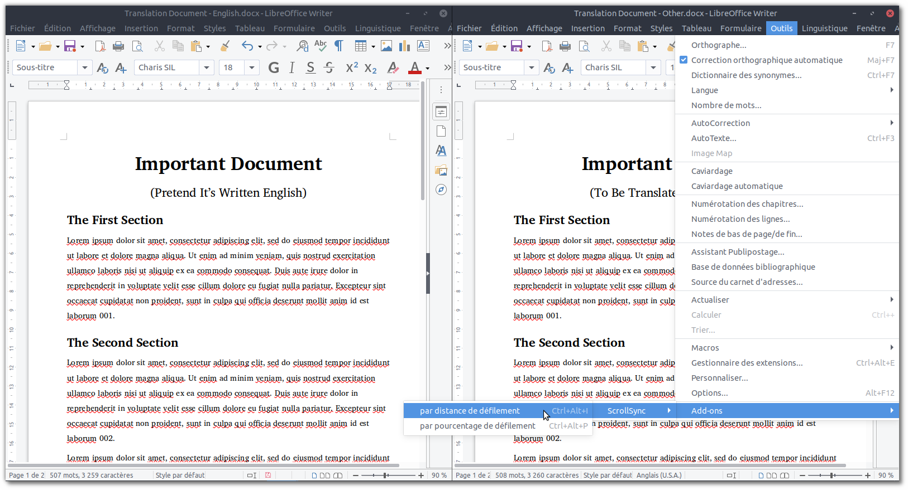
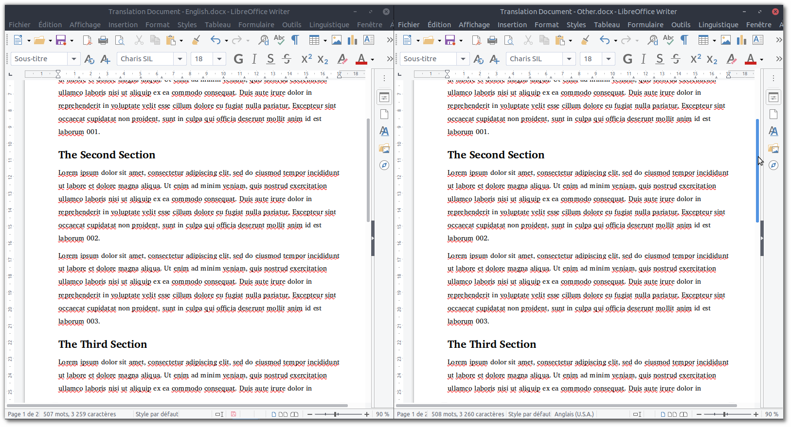

# Scroll Two LibreOffice Text Documents Simultaneously

Scroll position can be synchronized either by distance from the beginning of the
document or by percentage of total document length.

## Demo

https://github.com/sil-car/scroll-sync/assets/23388501/5f757dbf-e5a8-4285-b579-41687af632e6

## References

### Scripting
- UNO API: https://api.libreoffice.org (/docs/idl/ref/)
- OOO Writer API: https://wiki.openoffice.org/wiki/Writer/API/
- https://wiki.documentfoundation.org/Documentation/DevGuide
- https://wiki.documentfoundation.org/Macros/Python_Design_Guide
- https://help.libreoffice.org/latest/en-US/text/sbasic/python/python_programming.html
- https://wiki.openoffice.org/wiki/Documentation/DevGuide/WritingUNO
- https://www.pitonyak.org/oo.php

### Packaging
- https://wiki.openoffice.org/wiki/UNO_component_packaging
- https://www.openoffice.org/udk/python/python-bridge.html
